

  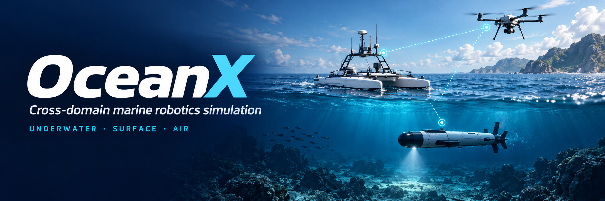
  
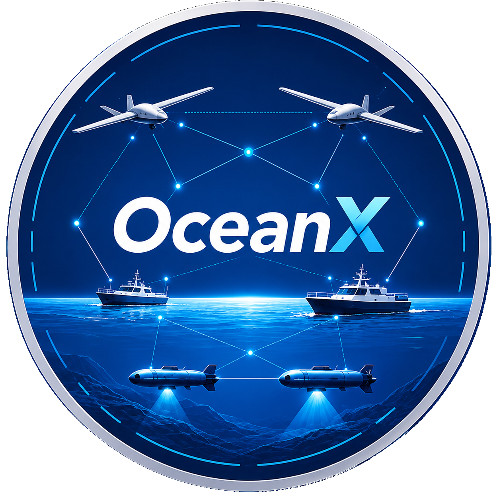

  <h1>OceanX</h1>
  
<strong>Multi-vehicle simulation for marine and cross-domain autonomy</strong>

  
Underwater · Surface · Air · Ground

  
Configure a scenario. Run closed-loop control. Observe sensors. Replay the experiment.

  

    
    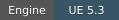
    
    
  

  

    
    
    
  

  

    <a href="#meet-oceanx">Overview</a> ·
    <a href="#cross-domain-marine-autonomy">Marine Domains</a> ·
    <a href="#sensor-gallery">Sensors</a> ·
    <a href="#interface-tour">Interface Tour</a> ·
    <a href="#vehicle-gallery">Vehicles</a> ·
    <a href="#an-experiment-from-start-to-finish">Workflow</a>
  

> [!NOTE]
> **OceanX 1.0.0 is in preparation.** This page introduces the current implementation. Public distribution and documentation details will be added when ready.

  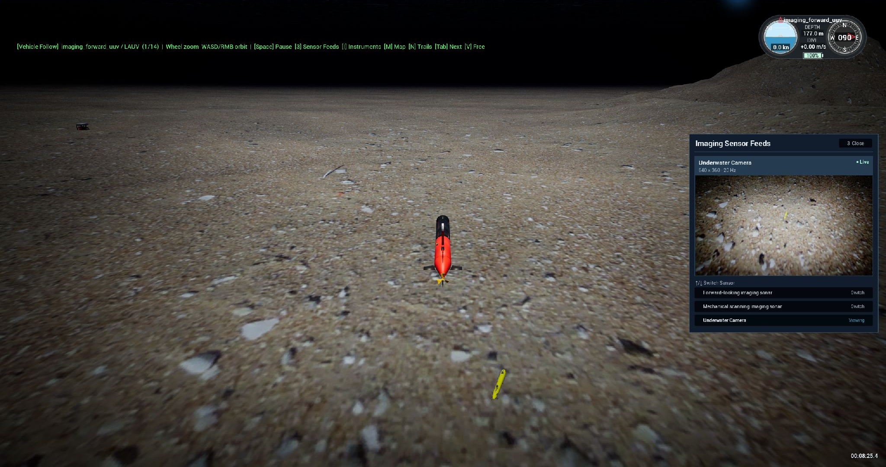

## Meet OceanX

OceanX brings 3D environments, vehicle dynamics, autopilot control, sensors, and experiment tools into one simulation workspace. Start with a single underwater robot to evaluate a controller, or combine underwater, surface, aerial, and ground vehicles in a shared scenario.

OceanX provides the environment, dynamics, sensors, and visualization. HydroX handles navigation estimation, guidance, control, and actuator allocation. ROS 2 connects external tasks and algorithms. In software-in-the-loop mode, each controlled vehicle runs an independent HydroX instance.

| Capability | What you can do |
|---|---|
| Multi-domain scenarios | Combine AUVs, ROVs, surface vessels, UAVs, and ground vehicles |
| Closed-loop control | Run HydroX in SITL or connect a physical flight controller through HITL |
| Environment configuration | Select a map and configure current, wind, sea level, and scene objects |
| Sensor observation | Inspect optical, LiDAR, sonar, and bathymetric sensor outputs |
| External algorithms | Run supervisory programs, send ROS 2 tasks, and inspect live data |
| Experiment capture | Take screenshots, record and replay simulation states, and associate rosbag and flight-controller logs |

## Cross-Domain Marine Autonomy

**Underwater robots, surface vessels, and aircraft can share the same ocean scenario.** OceanX's integrated ocean environment brings the water column, sea surface, seabed, and airspace into one world. Build a mixed vehicle group, configure each platform's controller and sensors, and switch observations between domains during an experiment.

The default cross-domain group contains an ECA A9 UUV at 100 m depth, a WAM-V USV at the sea surface, and an X500 UAV starting 45 m above it. Each vehicle uses its own HydroX SITL instance; external programs and ROS 2 tasks provide the experiment's control behavior.

| Domain | Example platform | Observation and experiment focus |
|---|---|---|
| Underwater | ECA A9, LAUV, SAGA, RexROV2 | Depth, underwater dynamics, optical and acoustic sensing |
| Surface | VRX WAM-V | Surface motion, heading, currents, and sea-surface conditions |
| Air | X500, RC Cessna, Standard VTOL | Aircraft state, aerial sensing, and wind conditions above the ocean |

### Surface · USV

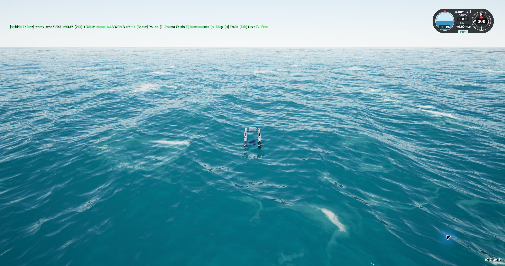

### Air · UAV

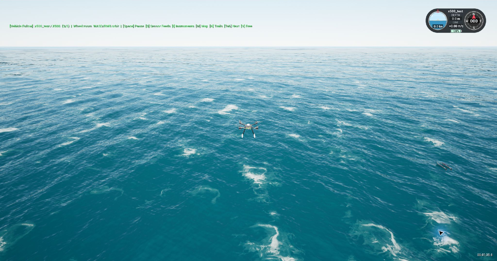

These views come from the same mixed-vehicle run. The UAV view also shows the surface vessel on the right; the underwater vehicle remains in the same scenario below the surface.

## Sensor Gallery

**Explore all nine imaging sensor types in the current validation lab.** The optical imager is shown underwater, at the surface, and from the air, giving eleven views. These are live sensor-panel captures from OceanX; click an image to see its full simulation viewport.

### Optical · Underwater, Surface & Air

<table>
  <tr>
    <td align="center" valign="top"><strong>Underwater Camera · UUV</strong> <a href="docs/assets/readme/15-optical-underwater.png">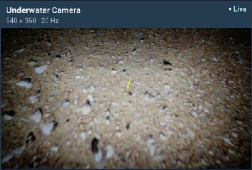</a> Illuminated seabed view from the LAUV's optical imager.</td>
    <td align="center" valign="top"><strong>Surface Camera · USV</strong> <a href="docs/assets/readme/16-optical-surface.png">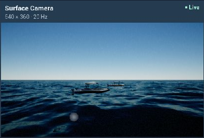</a> Vessel-mounted camera observing nearby surface platforms.</td>
  </tr>
  <tr>
    <td colspan="2" align="center"><strong>Air Camera · UAV</strong> <a href="docs/assets/readme/17-optical-air.png">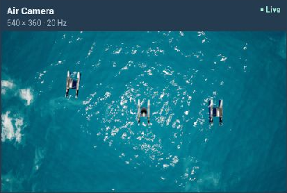</a> Downward X500 camera observing the same surface vehicle group.</td>
  </tr>
</table>

All three views use the optical imaging sensor with platform-specific mounts and profiles. The illustrated camera feeds sample at 640 × 360 pixels and 20 Hz.

### Acoustic · Imaging, Survey & Profiling

<table>
  <tr>
    <td align="center" valign="top"><strong>Forward-Looking Imaging Sonar</strong> <a href="docs/assets/readme/18-forward-looking-sonar.png">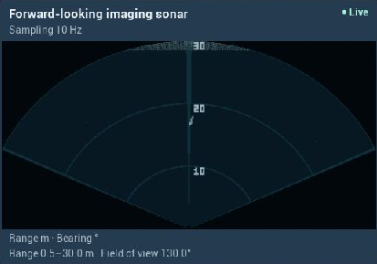</a> Echo intensity across slant range and bearing.</td>
    <td align="center" valign="top"><strong>Mechanical Scanning Imaging Sonar</strong> <a href="docs/assets/readme/19-mechanical-scanning-sonar.png">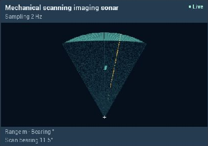</a> Successive pings build a sector scan; the active bearing is highlighted.</td>
  </tr>
  <tr>
    <td align="center" valign="top"><strong>Side-Scan Sonar</strong> <a href="docs/assets/readme/20-side-scan-sonar.png">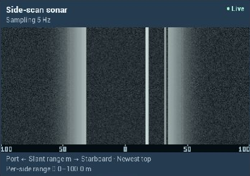</a> Port and starboard echo history, with the newest ping at the top.</td>
    <td align="center" valign="top"><strong>Multibeam Echosounder</strong> <a href="docs/assets/readme/21-multibeam-echosounder.png">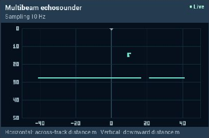</a> Current returns plotted by across-track and downward distance.</td>
  </tr>
  <tr>
    <td align="center" valign="top"><strong>Sub-Bottom Profiler</strong> <a href="docs/assets/readme/22-sub-bottom-profiler.png">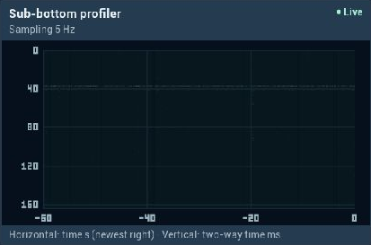</a> Processed echo intensity over history time and two-way travel time.</td>
    <td align="center" valign="top"><strong>Echo Sounder</strong> <a href="docs/assets/readme/23-echo-sounder.png">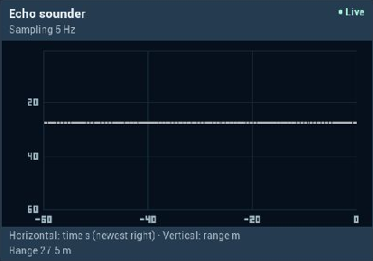</a> Single-beam range history, with the newest sample on the right.</td>
  </tr>
</table>

Range and multibeam coordinates are relative to the sensor. The profiler's vertical axis is two-way travel time; an echo band alone does not identify a sediment layer. Side-scan and profiling histories also advance while the vehicle is stationary.

### LiDAR · Range & Semantic Point Clouds

<table>
  <tr>
    <td align="center" valign="top"><strong>Rotating LiDAR · USV</strong> <a href="docs/assets/readme/24-rotating-lidar.png">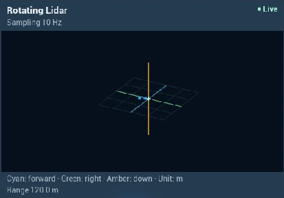</a> Current 3D returns, with brightness representing return intensity.</td>
    <td align="center" valign="top"><strong>Semantic LiDAR · UAV</strong> <a href="docs/assets/readme/25-semantic-lidar.png">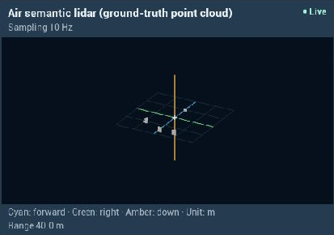</a> Current 3D returns with simulation ground-truth class labels.</td>
  </tr>
</table>

Both previews preserve the sensor's forward, right, and down coordinates in metres. Semantic colors come from configured simulation labels; unlabeled returns appear gray. The marine scene produces sparse returns from nearby vessels.

## Interface Tour

The main menu groups pages into simulation, workspace, and system tools. This tour follows an experiment from setup through observation and replay.

| Group | Page | Purpose |
|---|---|---|
| Simulation | Start Simulation / Simulation & Vehicles | Configure a vehicle group; start, pause, and reset a run |
| Simulation | Environment | Configure current, wind, water, seabed, and other scene objects |
| Workspace | Data & Interfaces | Inspect control links, run programs, and browse ROS 2 topics |
| Workspace | Views & Layout | Arrange cameras, sensor feeds, instruments, and the trajectory map |
| Workspace | Capture & Replay | Capture images, record experiments, and browse saved runs |
| System | Preferences | Adjust camera response, graphics quality, and interface language |
| System | Shortcuts | Look up keyboard controls |

### 01 · Start Simulation

**Choose the environment and assemble the vehicles for your experiment.**

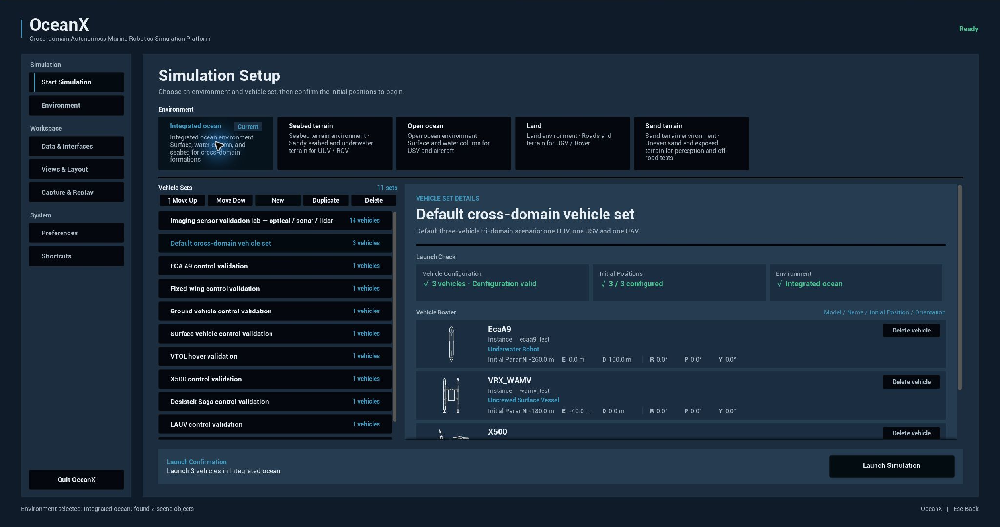

- Select a map and vehicle group; create, duplicate, reorder, or delete groups.
- Add vehicle models and edit instance names, group descriptions, and initial N/E/D positions.
- Check vehicle configuration, initial placement, and environment compatibility before starting.

The same setup supports single-vehicle tests and mixed groups. An empty group lets you explore an environment on its own.

### 02 · Environment

**Define the conditions your vehicles operate in.**

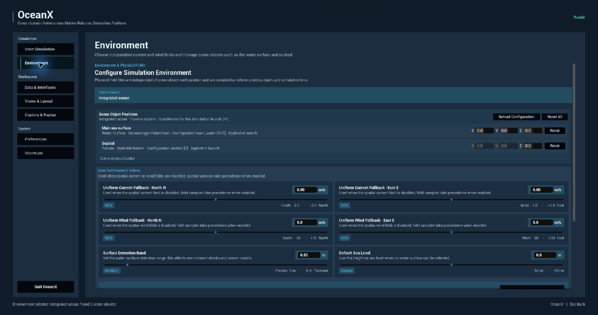

- Select and enable spatial current and wind fields sampled by position, depth or altitude, and simulation time.
- Visualize velocity fields and animated streamlines; adjust the display plane, spacing, and extent.
- Adjust uniform current and wind fallback values, sea level, and surface detection; position water, seabed, and other scene objects.

Use this page to configure repeatable calm-water, current, or wind-disturbance experiments.

### 03 · Simulation Viewport

**Observe vehicle motion and sensor outputs in the 3D world.**

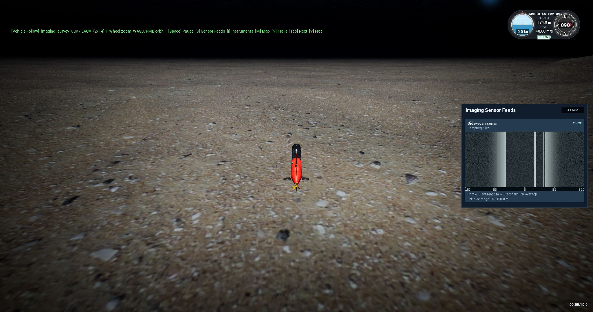

- Explore with a free camera or follow a selected vehicle; switch between vehicles during a run.
- Open sensor feeds and select an available sensor.
- Display telemetry instruments, a trajectory map, and 3D trails alongside the scene.

| Observation | Examples |
|---|---|
| Optical and ranging | Optical images, rotating LiDAR, semantic LiDAR |
| Sonar and bathymetry | Forward-looking and mechanical scanning sonar, multibeam bathymetry, side-scan sonar, sub-bottom profiling, echo sounding |
| Vehicle state | Telemetry instruments, trajectory map, scene trails |

Available feeds depend on the selected vehicle's sensor configuration.

### 04 · Simulation & Vehicles

**Manage an experiment while it is running.**

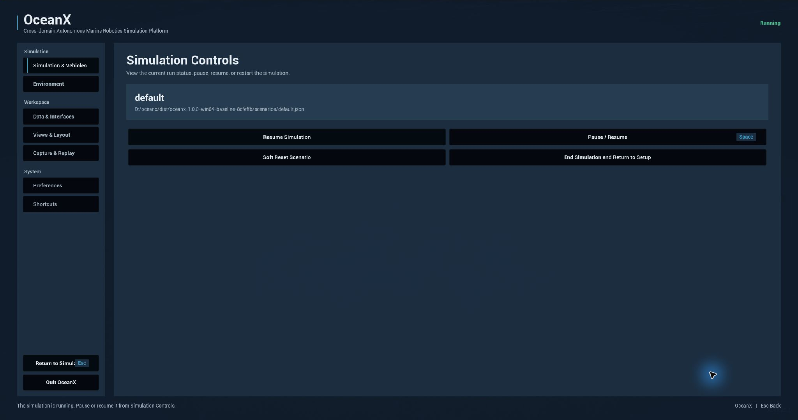

- Inspect the active vehicle group and pause or resume the simulation.
- Use **Soft Reset Scenario** to return vehicles to their initial states.
- End the run and return to setup to prepare the next experiment.

Press `Esc` to open the menu. Opening it keeps the simulation running; pause is a separate action.

### 05 · Data & Interfaces / Control Links

**Check that every vehicle has a working control connection.**

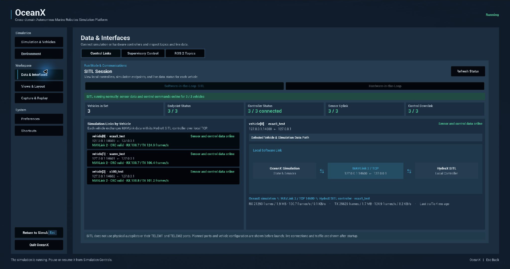

- Choose SITL or HITL before a run and inspect each vehicle's controller configuration and communication endpoints.
- In SITL, monitor connection readiness, sensor uplink, and control downlink.
- In HITL, inspect hardware mappings, the TELEM1 main link, and the TELEM2 control link; reconnect the bench when needed.

The current HITL path targets Pixhawk / FMUv6C benches. Hardware adaptation and qualification are specific to the device and vehicle configuration.

#### Hardware-in-the-Loop Bench

**Connect a physical autopilot to the simulated vehicle and inspect both hardware links.** The HITL page maps each vehicle to an autopilot slot, discovers serial ports, and displays the Pixhawk, USB-UART adapters, ROS bridges, and link readiness before launch.

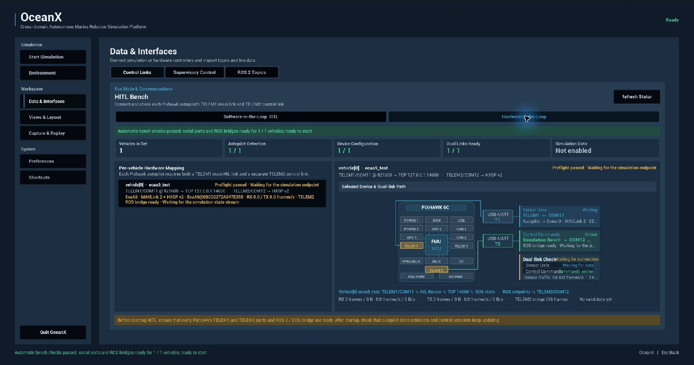

| Link | Role |
|---|---|
| TELEM1 | Main HIL link between the simulated vehicle and physical autopilot |
| TELEM2 | Separate control-command link for the configured bench or external controller |
| ROS 2 / DDS | State and task interfaces exposed through the bench bridges |

The screenshot shows discovered COM11 and COM12 ports with the bench connection not ready. It illustrates hardware mapping and connection diagnostics; it is not a completed hardware closed-loop run. Launch requires the relevant device, bridge, and link checks to pass.

### 06 · Data & Interfaces / Supervisory Control

**Run a task program and inspect its output from the interface.**

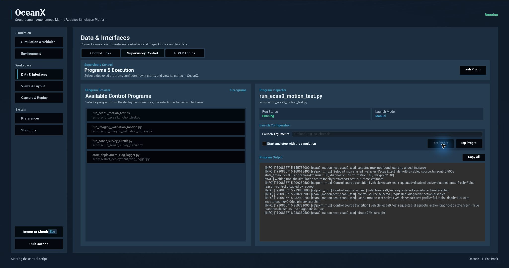

- Browse and refresh deployed Python programs, then configure launch arguments.
- Start and stop a program manually, or let it start and stop with the simulation.
- Inspect live process status and output, and copy the output for analysis.

Use deployed programs for waypoint tasks, control validation, or custom algorithms. Task behavior is provided by the selected program.

### 07 · Data & Interfaces / ROS 2 Topics

**Inspect message interfaces and live data inside the simulation workspace.**

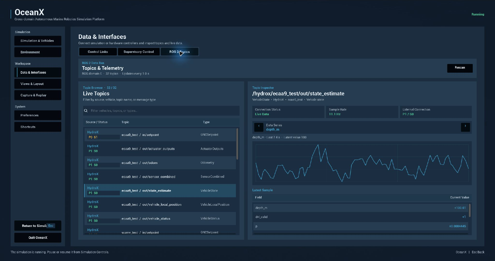

- Filter visible topics by source, vehicle, topic name, or message type.
- Select a topic to inspect connection status, sample rate, numeric fields, and data series.
- View supported range scans and acoustic target data as plots.

This page requires a working ROS 2 environment. It monitors the selected topic in read-only mode to help check task inputs and vehicle outputs.

### 08 · Views & Layout

**Choose the information you want on screen.**

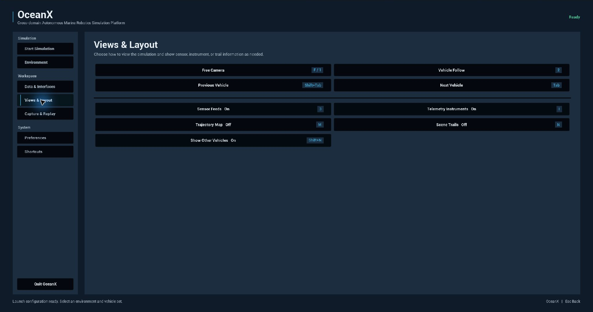

- Switch between free and follow cameras, and select the previous or next vehicle.
- Toggle sensor feeds, telemetry instruments, and the trajectory map.
- Show scene trails for the selected vehicle or include other vehicles.

Focus on a sensor's output or keep the wider vehicle group in view.

### 09 · Capture & Replay

**Save an experiment and revisit what happened.**

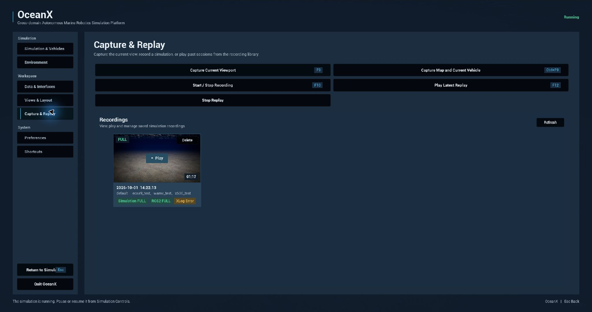

- Capture the current viewport or a set of views for the map and selected vehicle.
- Start and stop recording; browse, play, or delete entries in the recording library.
- Pause, seek, and change playback speed; switch between interactive and recorded cameras.

Replay stores simulation states for playback, rosbag stores ROS messages, and HydroX XLog stores flight-controller diagnostics. XLog runs independently with the controller process; experiment recordings associate the corresponding diagnostic logs.

### 10 · Preferences

**Tune camera response and display quality.**

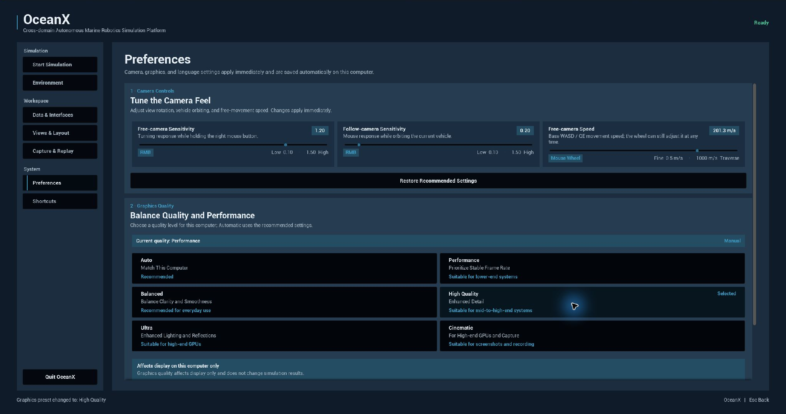

- Adjust free-camera and follow-camera sensitivity and free-camera movement speed.
- Choose Automatic, Performance, Balanced, High Quality, Ultra, or Cinematic graphics presets.
- Switch between English and Simplified Chinese; preferences apply immediately and are saved locally.

### 11 · Shortcuts

**Reach common observation and capture tools while a run is active.**

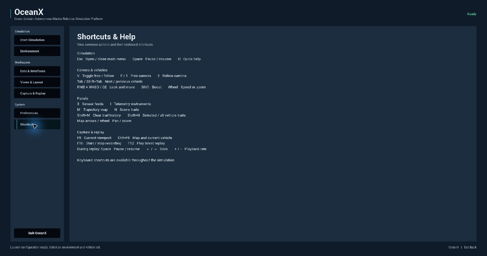

| Key | Action |
|---|---|
| `Esc` | Open the menu / return to the simulation |
| `Space` | Pause / resume simulation or replay |
| `Tab` / `Shift+Tab` | Select the next / previous vehicle |
| `V` | Switch between free and follow cameras |
| `F` / `1`; `2` | Free camera; follow camera |
| `3`; `↑` / `↓` | Toggle sensor feeds; switch sensors while the feed is open |
| `I`; `M` | Telemetry instruments; trajectory map |
| `N` / `Shift+N` | Toggle scene trails / switch selected-vehicle and all-vehicle trails |
| `F9` / `Ctrl+F9` | Capture the viewport / capture the map and selected vehicle |
| `F10` | Start / stop experiment recording |
| `F12`; `R` | Play the latest replay; switch camera mode during replay |

## Vehicle Gallery

The current vehicle catalog spans underwater, surface, aerial, and ground platforms. Combine models in a vehicle group and configure sensors and control parameters for each instance.

<table>
  <tr>
    <td align="center">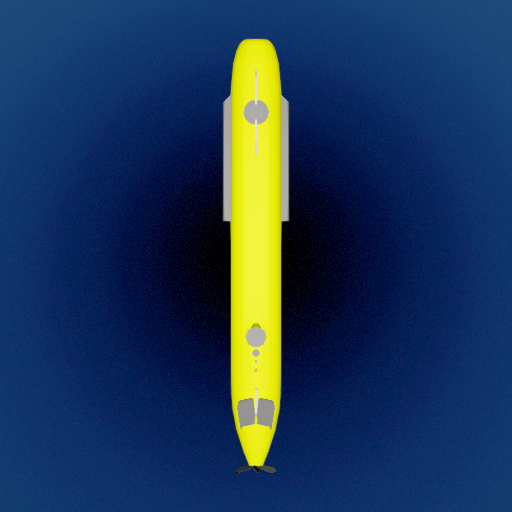 <strong>ECA A9</strong> AUV</td>
    <td align="center">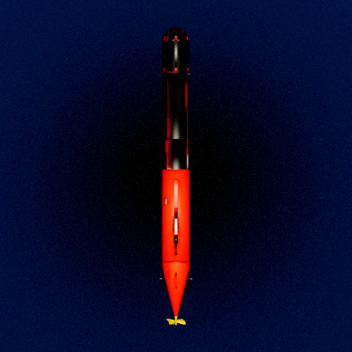 <strong>LAUV</strong> AUV</td>
    <td align="center">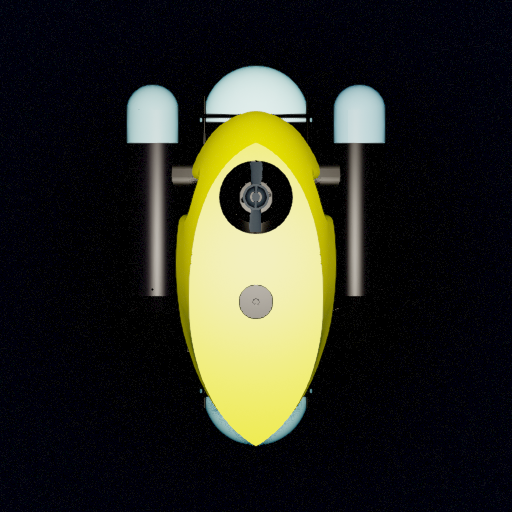 <strong>Desistek SAGA</strong> ROV</td>
  </tr>
  <tr>
    <td align="center">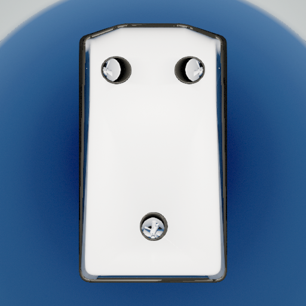 <strong>RexROV2</strong> ROV</td>
    <td align="center">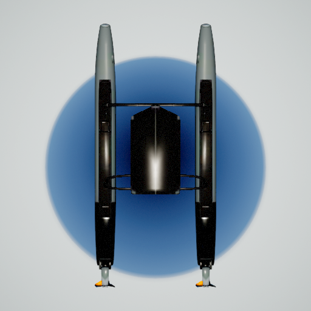 <strong>VRX WAM-V</strong> USV</td>
    <td align="center">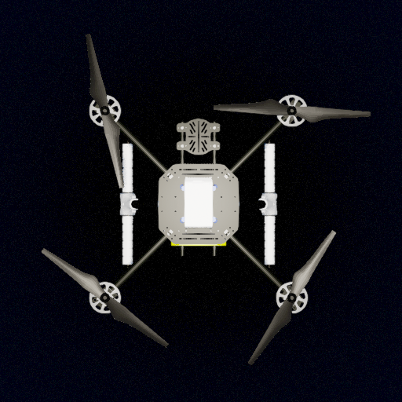 <strong>X500</strong> Multirotor UAV</td>
  </tr>
  <tr>
    <td align="center">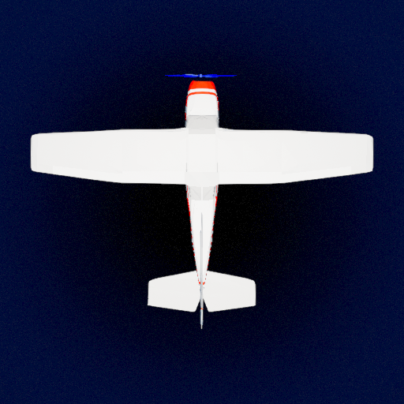 <strong>RC Cessna</strong> Fixed-wing UAV</td>
    <td align="center">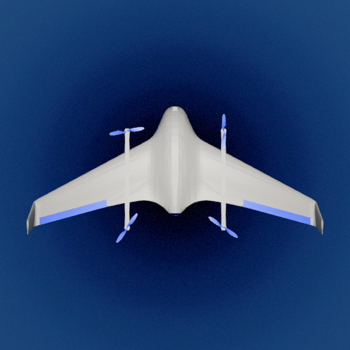 <strong>Standard VTOL</strong> VTOL UAV</td>
    <td align="center">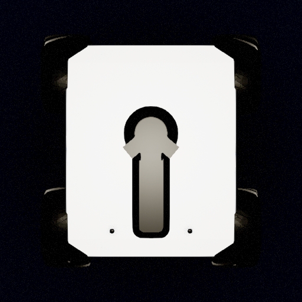 <strong>R1 Rover</strong> UGV</td>
  </tr>
</table>

## An Experiment from Start to Finish

1. **Prepare the scenario.** Select an environment, create or duplicate a group, add vehicles, and set initial positions.
2. **Define the conditions.** Configure current and wind fields, then check SITL or HITL settings in Control Links.
3. **Run and control.** Start the simulation and send tasks through a supervisory program or ROS 2.
4. **Observe and inspect.** Follow a vehicle, watch sensor feeds and trajectories, and inspect topics when needed.
5. **Record and review.** Capture images, record the experiment, and revisit the run alongside its logs.

## Platform & Availability

- **Windows / Win64:** the primary development and validation platform; standalone runtime packaging is implemented.
- **ROS 2:** external control and topic inspection require a compatible runtime and interface support.
- **HITL:** software links and bench tools are implemented; physical hardware qualification remains device-specific.
- **Linux:** no prebuilt runtime is currently available.

## License

OceanX's own core uses a proprietary license. Unreal Engine, Oceanology, vehicle models, and other third-party components retain their respective licenses and copyright terms. Use and redistribution are governed by the terms supplied with the relevant deliverable.
